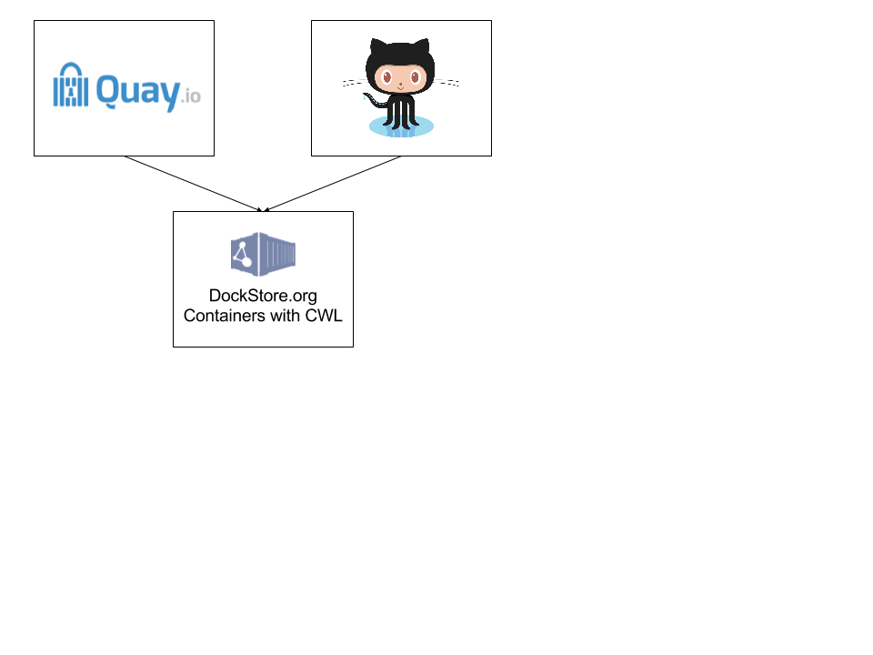

# About Dockstore

The Dockstore concept is simple, provide a place where users can share tools
encapsulated in Docker and described with the [GA4GH](http://genomicsandhealth.org/)
[Common Workflow Language](http://common-workflow-language.github.io/) (CWL).
This enables scientists, for example, to share analytical tools in a way that makes them
machine readable and runnable in a variety of environments.  While the Dockstore is focused
on serving researchers in the biosciences the combination of Docker + CWL can be used
by anyone to describe the tools and services in their Docker images in a standardized,
machine readable way.

## Built with Quay.io and Github

Docker repositories, like
[DockerHub](https://hub.docker.com/) and [Quay.io](https://quay.io/), and
source control repositories like [GitHub](http://github.com) and
[BitBucket](https://bitbucket.org/), provide
much of the infrastructure we need.  They allow users build, publish,
and share both public and private Docker images.  However, the services lack a standardized ways of
describing how to invoke tools contained within the Docker containers.  The CWL
standard has defined a way to define the inputs, parameterizations, and outputs
of tools using a YAML-formated file.  Together, these resources provide the
necessary tools to share analytical tools in a highly portable way, a key
concern for the scientific community.

## Best Practices

First and foremost, the Dockstore has no requirements for what you register provided:

0. you can host the Docker image on Quay.io (and others in the future) which is linked to [GitHub](http://github.com) for automated building
0. you have a corresponding `Dockstore.yml` in CWL format that describes how to call the tools inside your Docker image

Over time, we find "skinny" Docker, those with single tools installed in them,
are more helpful for extending and building new workflows with.  That being said,
"fat" Docker containers, which include multiple tools and even full workflows
with frameworks like [SeqWare](http://seqware.io) or [Galaxy](https://galaxyproject.org/),
can have their place as well.  Projects like the ICGC
[PanCancer Analysis of Whole Genomes](https://dcc.icgc.org/pcawg) (PCAWG) made use of "fat"
Docker containers that had complex workflows that fully encapsulated alignment and
variant calling.  The self-contained nature of these Docker containers allowed
for mobility between a wide variety of environments and greatly simplified
the setup of these pipelines across a wide variety of HPC and cloud environments.
Either approach works for the Dockstore so long as you can describe the tool
or workflow inside the Docker container as a CWL-defined tool (which you can
for most things).

## Promoting Standards

We hope Dockstore provides a reference implementation for Container sharing
in the sciences.  The Dockstore is essentially a proof of concept designed
as a starting point for two activities that we hope can results in community
standards within the GA4GH:

* a best practices guide for describing tools in Docker containers with CWL
* a minimal web service standard for registering, searching and describing CWL-annotated Docker containers that can be federated and indexed by multiple websites similar to [Maven Central](http://search.maven.org/)

## Building a Community

Several large projects in the Biosciences, specifically cancer sequencing projects
such as PCWAG, have expressed interest in registering tools and workflows in the Dockstore
system.  We hope this work can spawn the registration of a large number of high-quality
tools in the system.

## Future Plans

We plan on expanding the Dockstore in several ways over the coming months:

* allow users to register CWL and Docker image tar files with simple URLs in addition to the current Quay.io-based system
* support DockerHub as a location for hosting Dockstore images
* support BitBucket and other Git repositories for Dockerfiles and Dockstore.yml
* work to promote a standardized web service API for sharing Docker-based tools through the GA4GH so other sites can register Docker images described with CWL and we can cross index, think [MavenCentral](http://search.maven.org/)
* publish Dockstore images for tools from the [PCAWG](https://dcc.igcg.org/pcawg) and other projects to help seed the Dockstore
* look at linking to tools defined by other standards such as [Galaxy Toolshed](https://toolshed.g2.bx.psu.edu/) and [Elixir](https://elixir-registry.cbs.dtu.dk/)
* support for hosting multiple Dockerfiles and Dockstore.cwl files in the same git repository
* support for distinct versions of `Dockstore.cwl` associated with each "tag" in Quay.io (currently the most recent `Dockstore.cwl` on the default git branch is used)
* support for [EDAM ontology](http://edamontology.org/page) terms to describe input and output files
* support for community tagging and star ratings for tools
* support for better browsing of tools on the site, think faceted browser like the [ICGC DCC Portal](https://dcc.icgc.org)
* examples of how to make workflows in CWL that bring together individual tools, and to scale up analysis using cloud orchestration systems like [Consonance](https://github.com/Consonance/)
